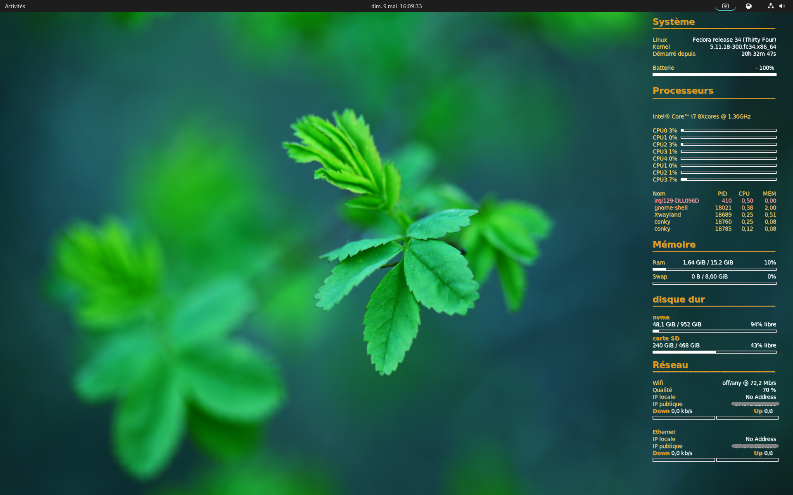
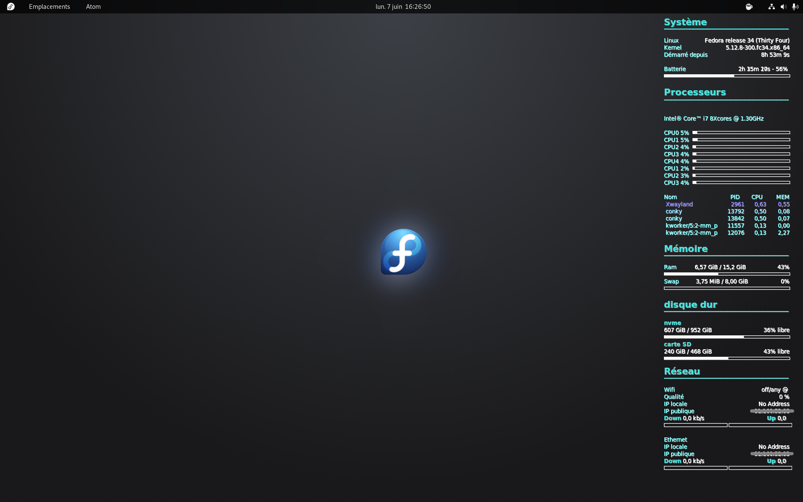
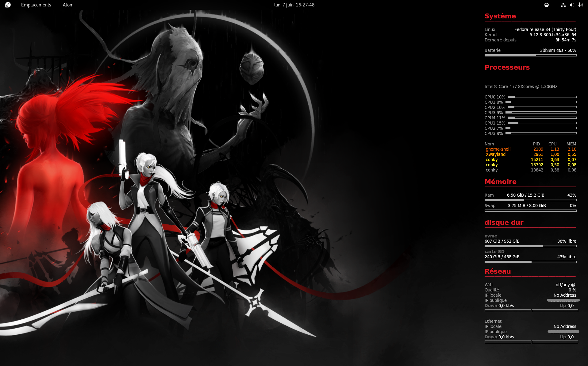

**Conky** avec     **Fedora WS** ***33&34***
          et sous  **Fedora i3** ***33>35*** & ***Pop_OS*** ***20.04***  
  
/!\ Ne fonctionne pas sous Gnome 40,41,42 ...   
  

Exemple du thème Basic:  
  
  
thème Aqua:  

  
thème Red:  
  

thème Pop_OS:  

